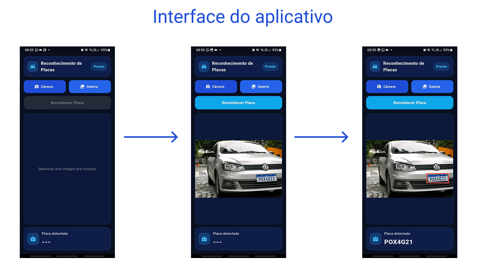

<a id="topo"></a>

<div>
  <h1>Aplicativo de Reconhecimento de Placas</h2>

  <p>
    Sistema completo de <b>Reconhecimento Automático de Placas Veiculares</b><br/>
    <b>Flutter</b> + <b>FastAPI</b> + <b>YOLOv8</b> + <b>PaddleOCR</b>.
    <br /><br />
    <a href="https://github.com/FabinDr/Processamento_de_Imagem/releases/tag/v1.0.0"><strong>🔗 ACESSAR O APP</strong></a>
  </p>

</div>

---

## Identificação do Trabalho

> **Disciplina:** Processamento de Imagens<br />
> **Instituição:** Universidade Federal do Maranhão (UFMA)<br />
> **Docente:** Dr. HAROLDO GOMES BARROSO FILHO<br />

### 👤 Discentes
- **Dupla:**  
  - Fabio Duarte Ribeiro  
  - Eliaquim Santos 

---

## 📌 Sumário

- [📖 Sobre o Projeto](#sobre-o-projeto)
- [🧰 Tecnologias e Bibliotecas Utilizadas](#tecnologias)
- [📂 Estrutura do Repositório](#estrutura)
- [🔄 Diagrama do Funcionamento](#diagrama)
- [📸 Demonstração](#demonstracao)
- [✅ Instalação e Execução](#instalacao)
  - [⚡ Método 1 (Recomendado) — Flutter + API Hugging Face](#metodo-1)
  - [🧠 Método 2 (Local) — Backend FastAPI + Flutter](#metodo-2))
- [📱 Como Usar o App](#como-usar)
- [📚 Dataset](#dataset)

---

<a id="sobre-o-projeto"></a>
## 📖 Sobre o Projeto

<div align="justify">

Este projeto implementa uma solução completa de **Reconhecimento Automático de Placas** em imagens, com foco em **uso prático em celular**.  
O sistema é capaz de:

- detectar a placa na imagem (**YOLOv8**)  
- recortar a região correta com margem (**crop + padding**)  
- tratar problemas comuns de imagens de celular (**correção EXIF**)  
- melhorar contraste para OCR (**pré-processamento OpenCV / CLAHE**)  
- extrair o texto final da placa (**PaddleOCR**)  
- retornar JSON padronizado para o app desenhar a bbox (**bbox_norm**)
</div>

---

<a id="tecnologias"></a>

## 🧰 Tecnologias e Bibliotecas Utilizadas

### Backend (FastAPI)
- **Python 3.10+**
- **FastAPI** — criação da API REST
- **Uvicorn** — servidor ASGI
- **Ultralytics YOLOv8** — detecção da placa (bounding box)
- **PaddleOCR** — reconhecimento do texto (OCR)
- **OpenCV** — processamento de imagem (pré-processamento)
- **Pillow** — leitura da imagem e correção EXIF
- **python-dotenv** — variáveis de ambiente (.env)

### Frontend (Flutter)
- **Flutter / Dart**
- **image_picker** — câmera/galeria
- **http** — envio multipart para API
- **flutter_image_compress** — compressão para performance
- **CustomPaint** — desenho do retângulo (bbox)

---

<a id="estrutura"></a>

## 📂 Estrutura do Repositório

```txt
Processamento_de_Imagem/
├── backend_api/        # API FastAPI + pipeline (YOLO + OCR)
├── flutter_app/        # App Flutter (envia imagem e exibe bbox)
├── notebooks/          # testes/treino/validações
└── docs/               # imagens e assets do README (pipeline.png, prints, etc.)
````

---

<a id="diagrama"></a>

## Diagrama do Funcionamento do Projeto

<div align="center">
  
</div>

---

### 🔎 Explicação do Fluxo (etapa por etapa)

1. **Flutter** captura/seleciona a imagem
2. **HTTP Multipart POST /predict** envia imagem ao backend
3. **FastAPI** recebe a imagem
4. **Correção EXIF** corrige rotação do celular (fotos rotacionadas)
5. **YOLOv8** detecta a placa (bbox)
6. **Crop + Padding** recorta a região da placa com margem extra
7. **Pré-processamento** (Cinza + CLAHE) melhora contraste
8. **PaddleOCR** realiza leitura do texto
9. **Resposta JSON** retorna `plate` + `bbox_norm`
10. **Flutter** exibe texto e bbox vermelha no app

---

<a id="demonstracao"></a>

## 📸 Demonstração (prints)

<div align="center">
  
</div>

---

<a id="instalacao"></a>

# Instalação e Execução

Existem **2 formas** de testar este projeto:

- **Método 1 (Recomendado / Mais rápido):**
Você roda **apenas o Flutter no celular**, e o app consome a **API pronta no Hugging Face** (criada por nós).
➡️ Ideal para **testar rápido** sem instalar Python e sem rodar backend no PC.

- **Método 2 (Local / Completo):**
Você roda o **backend FastAPI no seu computador** e conecta o Flutter nele.
➡️ Ideal para **desenvolvimento**, melhorias e testes mais avançados.

---
<a id="metodo-1"></a>
# ⚡ Método 1 (Recomendado) — Flutter + API Hugging Face

Este é o jeito mais rápido de rodar o projeto, pois você **não precisa instalar Python nem rodar o backend localmente**.

---

## 🌐 API utilizada (Hugging Face)

* **Endpoint oficial da API:**
  🔗 [https://fabdrb-flutter-app.hf.space/predict](https://fabdrb-flutter-app.hf.space/predict)

* **Repositório do Space:**
  🔗 [https://huggingface.co/spaces/fabdRb/anpr_app/tree/main](https://huggingface.co/spaces/fabdRb/anpr_app/tree/main)

---

## O que você vai precisar

Antes de começar, tenha:

*  Um **PC** com Flutter instalado
* Um **celular Android**
* Um **cabo USB** (que suporte dados, não apenas carregamento)
  
---

## Pré-requisitos (instalações necessárias)

* **Git**
  [https://git-scm.com/downloads](https://git-scm.com/downloads)

* **Flutter SDK**
  [https://docs.flutter.dev/get-started/install](https://docs.flutter.dev/get-started/install)

📌 Após instalar o Flutter, confirme no terminal:

```bash
flutter --version
```

E rode o verificador:

```bash
flutter doctor
```
 O ideal é aparecer tudo como `✓` (ou pelo menos o Android Toolchain OK).

---

## Passo a passo (modo rápido)

### 1) Clonar o repositório

```bash
git clone https://github.com/FabinDr/Processamento_de_Imagem.git
cd Processamento_de_Imagem
```

### 2) Entrar na pasta do Flutter

```bash
cd flutter_app
```

### 3) Instalar dependências do projeto Flutter

```bash
flutter pub get
```

### 4) Confirmar a URL da API no Flutter 

No arquivo:

📌 `flutter_app/anpr_flutter/lib/main.dart`

Procure:

```dart
const String apiUrl = "https://fabdrb-flutter-app.hf.space/predict";
```

 Se estiver igual acima, não precisa alterar nada.

---

## Conectar o celular via USB (para rodar o app)

### No celular (ativar modo desenvolvedor)

1. Vá em **Configurações → Sobre o telefone**
2. Toque **7 vezes** em **Número da versão**
3. Volte e abra **Opções do desenvolvedor**
4. Ative **Depuração USB**
5. Conecte o celular no PC via USB
6. Aceite o pop-up **Permitir depuração USB**

---

## Rodar o app no celular

Com o celular conectado via USB, execute:

```bash
flutter run
```

 O Flutter irá:

* identificar o celular
* instalar o app automaticamente
* abrir o aplicativo

📌 Se quiser ver os dispositivos conectados:

```bash
flutter devices
```

---
<a id="metodo-2"></a>
# 🧠 Método 2 (Local) — Backend FastAPI + Flutter
---

## Pré-requisitos (Modo Local)

* **Git**
  [https://git-scm.com/downloads](https://git-scm.com/downloads)

* **Python 3.9+**
  [https://www.python.org/downloads/](https://www.python.org/downloads/)

* **Flutter SDK**
  [https://docs.flutter.dev/get-started/install](https://docs.flutter.dev/get-started/install)

> Opcional:

* **Docker**
  [https://www.docker.com/products/docker-desktop/](https://www.docker.com/products/docker-desktop/)

---

## Passo a passo (Modo Local)

### 1) Clonar o projeto

```bash
git clone https://github.com/FabinDr/Processamento_de_Imagem.git
cd Processamento_de_Imagem
```

---

## 2) Rodar BACKEND (FastAPI)

### 2.1) Entrar na pasta do backend

```bash
cd backend_api
```

### 2.2) Criar ambiente virtual

```bash
python -m venv .venv
```

### 2.3) Ativar ambiente virtual

**Windows (PowerShell):**

```bash
.venv\Scripts\Activate.ps1
```

**Windows (CMD):**

```bash
.venv\Scripts\activate.bat
```

**Linux/Mac:**

```bash
source .venv/bin/activate
```

### 2.4) Instalar dependências

Se existir `requirements.txt`:

```bash
pip install -r requirements.txt
```

✅ Se não existir:

```bash
pip install fastapi uvicorn opencv-python ultralytics paddleocr numpy pillow
```

### 2.5) Subir a API

```bash
uvicorn main:app --reload --host 0.0.0.0 --port 8000
```

✅ API online:

* [http://localhost:8000](http://localhost:8000)

✅ Swagger:

* [http://localhost:8000/docs](http://localhost:8000/docs)

---

## 4) Rodar Flutter conectado ao backend local

### 4.1) Entrar na pasta Flutter

```bash
cd ../flutter_app
```

### 4.2) Instalar dependências

```bash
flutter pub get
```

### 4.3) Ajustar URL da API no Flutter ⚠️

Procure:

```dart
const String apiUrl = "https://fabdrb-flutter-app.hf.space/predict";
```

✅ **Emulador Android**

```txt
http://10.0.2.2:8000/predict
```

✅ **Celular físico**

```txt
http://SEU_IP_LOCAL:8000/predict
```

Exemplo:

```txt
http://192.168.0.10:8000/predict
```

### 4.4) Rodar

```bash
flutter run
```

---

<a id="como-usar"></a>

# 📱 Como Usar o App

✅ Após rodar o aplicativo no celular:

### Passo a passo do usuário

1. Abra o app
2. Escolha uma opção:

   * 📸 **Capturar imagem**
   * 🖼️ **Selecionar da galeria**
3. Aguarde o processamento
4. Veja na tela:
   - texto da placa detectada
   - retângulo vermelho (bbox) desenhado na placa

### Dicas para melhorar a leitura do OCR

*  Use imagens **bem iluminadas**
*  Evite reflexos na placa
*  Placa deve estar **visível e centralizada**
*  Evite fotos muito borradas ou inclinadas

---

<a id="dataset"></a>

# 📚 Dataset

Dataset utilizado para treino:
🔗 [https://www.kaggle.com/datasets/barkataliarbab/license-plate-detection-dataset-10125-images](https://www.kaggle.com/datasets/barkataliarbab/license-plate-detection-dataset-10125-images)

---
